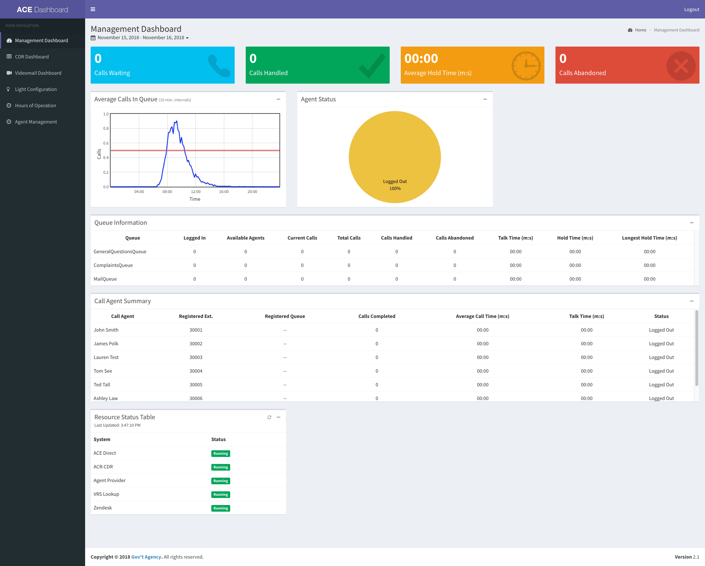
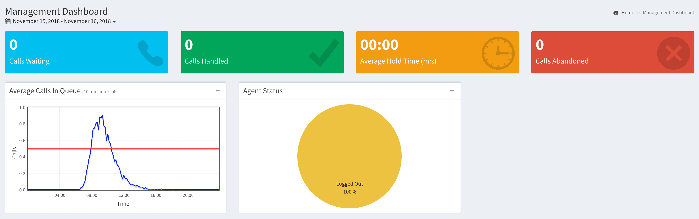
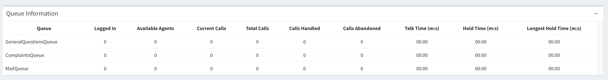
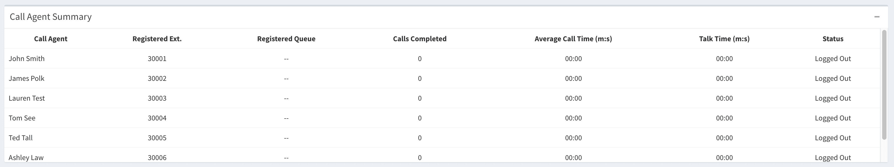
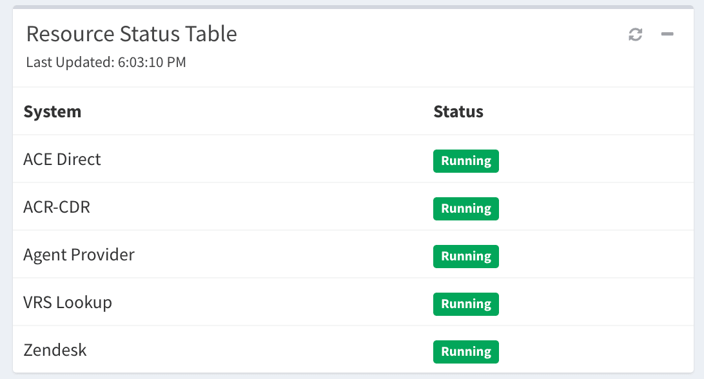

# ACE Management Portal Project

The ACE Management Portal consists of two components, the Management and Call Detail Record (CDR) dashboards. These dashboards present the manager with information about the operations of the call center and information about incoming calls.  

## SSL Configuration

1. ACE software uses SSL which requires a valid key and certificate.
1. The location of the SSL key and certificate is specified in the `dat/config.json` by using the `common:https:certificate` and `common:https:private_key` parameters in the form of folder/file (e.g., `/home/centos/ssl/mycert.pem` and `/home/centos/ssl/mykey.pem`).
1. Additional information can be found in the ACE Direct Platform Release documentation.

## Getting Started

To install the management portal, follow the README.md file in the autoinstall folder. The instructions for manual install are also provided below for reference.

1. Clone this repository
1. Download and install or update [Node.js](https://nodejs.org/en/)
1. Run the required build script: cd into the managementportal directory, run `npm run build`
1. To start the ACE Management Portal node server manually, run `node server-db.js`

## Accessing the Portal

1. ACE Management Portal: `http://host/ManagementPortal`

## Management Dashboard

### Overview

The Management Dashboard provides the manager/supervisor with a view of multiple **Key Performance Indicators** (or KPI's), all of which can be monitored in real time.

*Management Dashboard*

#### KPI Types

The dashboard provides **three** main types of Key Performance Indicators:

1. **Summary Data** - KPIs are a summary over all queues combined
1. **Queue Related KPIs** - KPIs are specific to each type of queue
1. **Agent Related KPIs** - KPIs are specific to each individual agent
1. **Resource Status KPIs** - KPIs related to the status of each service necessary for running ACE Direct

The data can be one of two types:

1. **Not Cumulative** - This only accounts for data that has been accumulated since the last restart of the Management Portal server
1. **Cumulative** - This data accounts for any and all data up to and including the current management session

#### Summary Data

| KPI                             | Description                                          | Cumulative?    |
|------------------------          |----------------------------------------------------  |------------  |
| Calls Waiting                    | Number of calls currently waiting in all queues       | No          |
| Calls Handled                    | Number of calls completed in all queues              | Yes           |
| Average Hold Time (m:s)           | Average call holding time across all queues          | Yes           |
| Calls Abandoned                  | Number of calls not answered in all queues           | Yes          |
| Average Calls in Queue (chart)    | Real time chart of average calls in queue           | No          |
| Agent Status (chart)            | Real time chart of agents logged in/out               | No          |

#### Queue Related KPIs

| KPI                       | Description                                          | Cumulative?   |
|-------------------------  |----------------------------------------------------  |-------------  |
| Logged In                 | Number of agents currently logged in to the system   | No            |
| Available Agents          | Number of agents currently in a ready state            | No            |
| Current Calls             | Number of calls currently in progress                | No            |
| Total Calls               | Total number of calls made                           | Yes           |
| Calls Handled             | Total number of calls answered by an agent            | Yes           |
| Calls Abandoned           | Number of calls abandoned (not answered)              | Yes            |
| Average Talk Time (m:s)   | Average talk time                                      | Yes           |
| Average Hold Time (m:s)   | Average hold time                                      | Yes           |
| Longest Hold Time (m:s)   | Longest hold time                                    | Yes           |

#### Agent Related KPIs

| KPI                       | Description                                                                    | Cumulative?   |
|-------------------------  |------------------------------------------------------------------------------  |-------------  |
| Call Agent                | Name of the agent                                                              | N/A           |
| Registered Extension      | Extension number assigned to the agent                                         | N/A           |
| Registered Queues         | Asterisk queues assigned to the agent                                         | N/A           |
| Calls Completed           | Number of calls that have been handled (answered and completed) by the agent   | Yes           |
| Average Call Time (m:s)   | The average call time for the agent                                           | Yes           |
| Talk Time (m:s)           | Total time the agent has spent on calls                                        | Yes           |
| Agent Status              | Current status of the agent (Logged Off, Ready, Away, or In-Call)              | N/A            |

#### Resource Status KPIs

1. **System** - A list of services required for ACE Direct to properly operate
2. **Status** - The current status of each service (Running or Unavailable)
